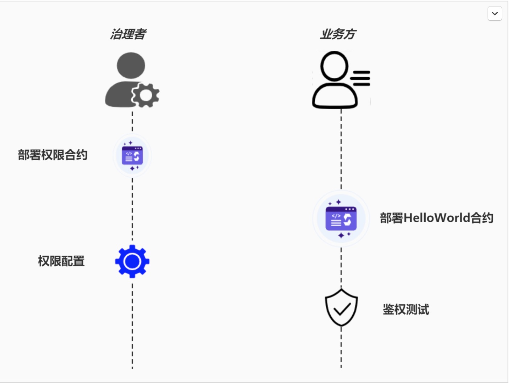

# 组件介绍

>随着智能合约业务日益丰富，越来越多的合约需要引入权限控制。如果不对智能合约做权限控制，那么无法满足业务的安全性要求。例如，存证场景中，除了上传存证的函数外，还有许多专供审核人员调用的函数，这些函数应仅由审核人员来使用，如果这些函数没有正确设置权限拦截逻辑，整套逻辑就会被攻击者轻易操控。

>contracts-authority-management的目的在于为智能合约开发者提供权限控制功能。开发者只要添加少量代码，即可拦截非法调用。同时，有一个专门的权限治理合约用于治理各个业务合约的拦截规则，对规则的修改只需操作权限治理合约，不需要调整业务合约，且修改会实时生效。

# 关键特性

* 函数级的权限粒度
* 批量设置用户权限
* 侵入性低
* 易于集成
* 支持可插拔的设计，对业务侵入小
* 支持多种治理方式

# 使用说明
>权限组件的使用者包括两个角色：治理方和业务方。治理方负责权限合约的部署、配置；业务方负责接入权限合约、拦截非法调用。这一节提供一个简单但完整的示例，通过部署并为业务合约HelloWorld配置权限，以使您了解整个组件的使用流程。这一节的内容包括：

* 【治理方】部署权限合约
* 【业务方】部署HelloWorld合约
* 【治理方】配置HelloWorld的权限
* 【业务方】权限验证



## 合约下载
>通过git下载源码，获取智能合约:

```git
git clone git@github.com:AlleriaWindrunner/contracts-authority-management.git
```

## 部署权限合约
>请使用您熟悉的方式将下载的合约部署到您使用的区块链上：

```
deploy AuthManager 1 [] [] 0
```

>AuthManager是权限治理合约。部署的时候可传入一组与运行模式有关的参数，按上面填写即可。部署成功后，会返回”contract address”字样和权限合约地址。

## 部署HelloWorld合约
>在治理方部署了权限治理合约后，业务方现在需要将权限治理合约引入自己的智能合约。

## 编写HelloWorld合约
>现在我们写有一个HelloWorld智能合约，它的代码如下：

```solidity
pragma solidity ^0.4.25;

contract HelloWorld{
    
    event Hello();
    function hello() public {
        emit Hello();
    }    
}
```

>为了实现权限管理，接下来引入前面下载的IAuthControl，以Solidity V0.4.25版本为例。按下述方式引入该合约：

```solidity
pragma solidity ^0.4.25;

import "./IAuthControl.sol";
contract HelloWorld{
    IAuthControl private _authManager;
    constructor(IAuthControl authManager){
        _authManager = authManager;
    }
    
    event Hello();
    function hello() public {
        require(_authManager.canCallFunction(address(this), msg.sig, msg.sender));
        emit Hello();
    }    
}
```

>引入可以分为三步：

* 第一步，导入IAuthControl.sol文件（第3行import）
* 第二步，在构造方法中传入权限治理合约的地址（第5到第8行）
* 第三步，在业务函数中引入权限治理合约的权限判断逻辑（第12行canCallFunction）。

>其中，为canCallFunction传入了三个参数，表示向权限合约询问“当前调用者是否有权限调用当前合约的当前函数”。通常，业务方在调用canCallFunction时，只需固定按此写法传参即可，这三个变量已经代表了当前的执行环境。它们含义分别为：

* address(this)：表示当前HelloWorld合约部署后的地址
* msg.sig：当前函数（本例中为hello）的函数签名。
* msg.sender表示当前函数的调用者。

## HelloWorld合约部署
>将HelloWorld.sol按照您熟悉的方式部署到您使用的区块链上：

```
deploy HelloWorld [权限合约地址]
```

>其中，构造函数传入的是权限合约地址，这个地址是前面权限合约部署后的地址。

>至此，业务方的接入工作已经完成，但现在部署后权限还没有起到效果，因为需要治理方在权限合约中进行权限规则配置。

## 权限配置
>由于权限治理合约是基于组的，需要先创立一个组，该组命名为exampleGroup，参数1表示这个组是白名单组，表示它关联的函数都是白名单模式，只有组内成员可以访问它关联的函数。

```solidity
call AuthManager [权限合约地址] createGroup "exampleGroup" 1
```

>随后，将测试账户添加到该组：

```solidity
call AuthManager [权限合约地址] addAccountToGroup [业务方的账户地址] "exampleGroup"
```

>最后，关联函数和组，这样只有该组允许访问此函数：

```solidity
call AuthManager [权限合约地址] addFunctionToGroup [HelloWorld合约地址] "hello()" "exampleGroup"
```

>经过如此配置后，则仅有业务方被允许访问hello函数。

## 验证
>当权限规则配置完毕，这个时候对HelloWorld的非法访问就会被拦截。

```solidity
call HelloWorld [HelloWorld合约地址] hello
The vm reverted.
```

>这个时候，由于该身份不在白名单内，访问就会报错。但如果以白名单组员的身份来调用HelloWorld，就可以成功：

```solidity
call HelloWorld [HelloWorld合约地址] hello
0x21dca087cb3e44f44f9b882071ec6ecfcb500361cad36a52d39900ea359d0895
```

# License

>开源协议为Apache License 2.0. 详情参考LICENSE。

